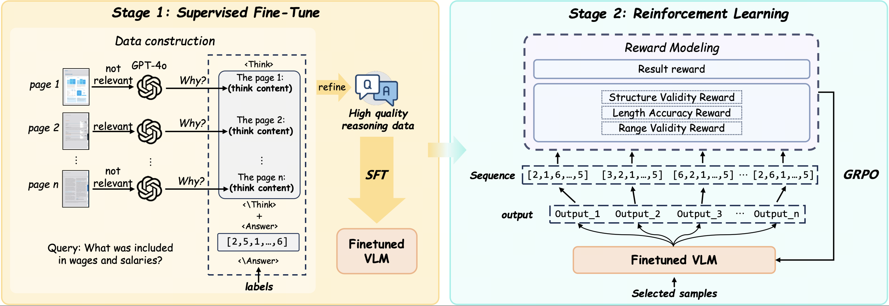

# MM-R5: MultiModal Reasoning-Enhanced ReRanker via Reinforcement Learning for Document Retrieval

[](https://arxiv.org/abs/2506.12364)
[](https://huggingface.co/i2vec/MM-R5)
[](https://github.com/i2vec/MM-R5)
****

## 📖 Table of Contents

- [📖 Table of Contents](#-table-of-contents)
- [📢 News](#-news)
- [📖 Introduction](#-introduction)
- [📈 Results](#-results)
- [🚀 Getting Started](#-getting-started)
- [🏷️ License](#️-license)
- [🖋️ Citation](#️-citation)
- [❤️ Acknowledgements](#️-acknowledgements)
- [⭐ Star History](#-star-history)

## 📢 News

- **Future**: Data construction pipeline and training code is on the way...
- **2025-06-20**: Our model [MM-R5](https://huggingface.co/i2vec/MM-R5) is now publicly available on Hugging Face!
- **2025-06-14**: Our publication [MM-R5: MultiModal Reasoning-Enhanced ReRanker via Reinforcement Learning for Document Retrieval](https://arxiv.org/abs/2506.12364) is now available!

## 📖 Introduction

We introduce **MM-R5**, a novel *Multimodal Reasoning-Enhanced ReRanker* designed to improve document retrieval in complex, multimodal settings. Unlike traditional rerankers that treat candidates as isolated inputs, MM-R5 incorporates explicit chain-of-thought reasoning across textual, visual, and structural modalities to better assess relevance. The model follows a two-stage training paradigm: during the supervised fine-tuning (SFT) stage, it is trained to produce structured reasoning chains over multimodal content. To support this, we design a principled data construction method that generates high-quality reasoning traces aligned with retrieval intent, enabling the model to learn interpretable and effective decision paths. In the second stage, reinforcement learning is applied to further optimize the reranking performance using carefully designed reward functions, including task-specific ranking accuracy and output format validity. This combination of reasoning supervision and reward-driven optimization allows MM-R5 to deliver both accurate and interpretable reranking decisions. Experiments on the MMDocIR benchmark show that MM-R5 achieves state-of-the-art top-k retrieval performance, outperforming strong unimodal and large-scale multimodal baselines in complex document understanding scenarios.


## 📈 Results

Our method, MM-R5, consistently achieves SoTA performance across most evaluation
metrics, including both macro and micro recall at different
thresholds. Compared with all retriever-only methods, MMR5 brings significant improvements, for instance, compared
with the previous SoTA retriever ColQwen, macro recall@1
improves from 0.6481 to 0.6951, and micro recall@1 improves from 0.6354 (ColQwen) to 0.6759, demonstrating the
effectiveness of our reranking strategy in refining the initial
retrieval results.

Across all retrievers and evaluation metrics, applying MM-R5 consistently improves both macro
and micro recall.


## 🚀 Getting Started

You can get the reranker from [here](https://github.com/i2vec/MM-R5/blob/main/examples/reranker.py)

```python
from reranker import QueryReranker

reranker = QueryReranker("i2vec/MM-R5")

query = "What is the financial benefit of the partnership?"
image_list = [
    "/path/to/images/image1.png", 
    "/path/to/images/image2.png", 
    "/path/to/images/image3.png", 
    "/path/to/images/image4.png", 
    "/path/to/images/image5.png"
]

predicted_order = reranker.rerank(query, image_list)

print(f"Query: {query}")
print(f"Reranked order: {predicted_order}")
```

## 🏷️ License

This repository is licensed under the **MIT License**. See the [LICENSE](LICENSE) file for details.

## 🖋️ Citation

If you use MM-R5 in your research, please cite our project:

```bibtex

@article{xu2025mm,
  title={MM-R5: MultiModal Reasoning-Enhanced ReRanker via Reinforcement Learning for Document Retrieval},
  author={Xu, Mingjun and Dong, Jinhan and Hou, Jue and Wang, Zehui and Li, Sihang and Gao, Zhifeng and Zhong, Renxin and Cai, Hengxing},
  journal={arXiv preprint arXiv:2506.12364},
  year={2025}
}
```

## ❤️ Acknowledgements

This project benefits from the following open-source projects:

- [SWIFT](https://github.com/modelscope/ms-swift)
- [VLM-R1](https://github.com/om-ai-lab/VLM-R1)

## ⭐ Star History

[](https://www.star-history.com/#i2vec/MM-R5&Date)
